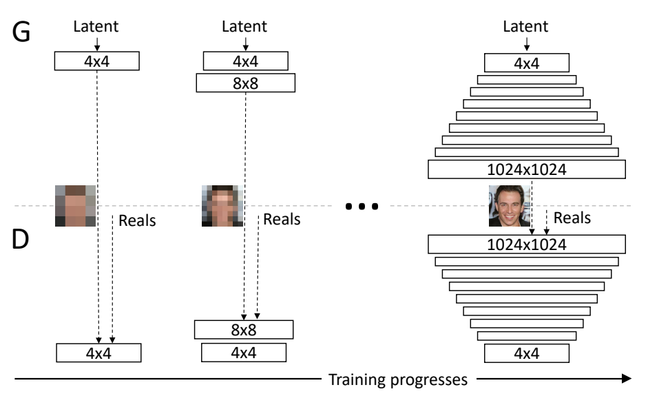
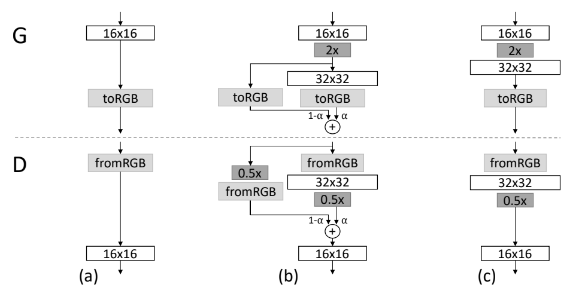

# PGGAN - Pytorch Implementation
PyTorch Implementation of [Karras et al., "Progressive Growing of GANs for Improved Quality, Stability, and Variation" (ICLR 2018)](https://arxiv.org/abs/1710.10196).


# Getting Started
## Dataset
**37345 Korean front face images** were used for train. Images were resized to `2**(scale_index+2)` x `2**(scale_index+2)` before passed to the model as input.

## Installation
* numpy
* opencv-python
* Pillow
* torch
* torchvision
* urllib3
* wandb

 To install the dependencies run:
```bash
pip install -r requirements.txt
```
## Checkpoint 
settings for training:
* add here! 

# Usage
## Train

```bash
python train.py --run_id simple_test
```
If you want to load a checkpoint and retrain it, use `--ckpt_id` and `--ckpt_step`
```bash
python train.py --run_id simple_test --ckpt_id={PATH/TO/CKPT} --ckpt_step {STEP}
```
If you want to use multi GPUs, add `--use_mGPU`  
If you want to use wandb, add `--use_wandb`

## Generate
```bash
python demo.py
```

# Overview
## Progressive Growing of GANs

Starting from low resolution image generating network, progressively add new blocks with larger scale to both generator and discriminator. In our code, for every `scale_jump_step`, both `model.G` and `model.D` call `add_block` function. 

## Smooth Resolution Transition

To fade the new blocks smooothly, there are weighted residual connections between layers. The generator upscales the previous block feature map by 2, then blends it with the new block feature map in the RGB domain.
```python
for i, block in enumerate(self.blocks, 0):
    x = block(x)
  
    # Lower scale RGB image
    if self.alpha > 0 and i == (len(self.blocks) - 2):
        x_prev = self.toRGB_blocks[-2](x, apply_upscale=True)

# Current scale RGB image
x = self.toRGB_blocks[-1](x)

# Blend!
if self.alpha > 0:
    x = self.alpha * x_prev + (1.0 - self.alpha) * x
```
 
 On the other hand, the discriminator downscales the current RGB input by 2 and pass it to the previous block. In this case, blending occurs in the feature domain.  
```python
# Lower scale features
if self.alpha > 0 and len(self.fromRGB_blocks) > 1:
    y = self.fromRGB_blocks[-2](x, apply_downscale=True)

# Current scale features
x = self.fromRGB_blocks[-1](x)

apply_merge = self.alpha > 0 and len(self.blocks) > 1
for block in reversed(self.blocks):
    x = block(x)

    # Blend!
    if apply_merge:
        apply_merge = False
        x = self.alpha * y + (1 - self.alpha) * x
```

## Objectives
**WGAN-GP loss** is used. Both generator and discriminator are optimized per every minibatch. In addition, **drift loss**, which is used to keep the discriminator output from drifting too far away from 0, is added to the discriminator loss.


## TO DO
- [x] implement fourth term of discriminator loss 
- [x] implement test.py
- [x] upload requirements.txt
- [ ] upload checkpoint and sample output
- [x] fix checkpoint loading part to automatically set scale & alpha jump related variables

## Authors
* Yukyeong Lee - geo1106@innerverz.com
* Wonjong Ryu

## Acknowledgements
* Karras et al. "Progressive Growing of GANs for Improved Quality, Stability, and Variation" (ICLR 2018) [[paper](https://arxiv.org/abs/1710.10196)][[code](https://github.com/tkarras/progressive_growing_of_gans)]
* [facebookresearch/pytorch_GAN_zoo](https://github.com/facebookresearch/pytorch_GAN_zoo) 
